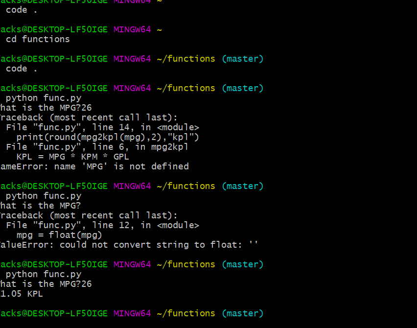
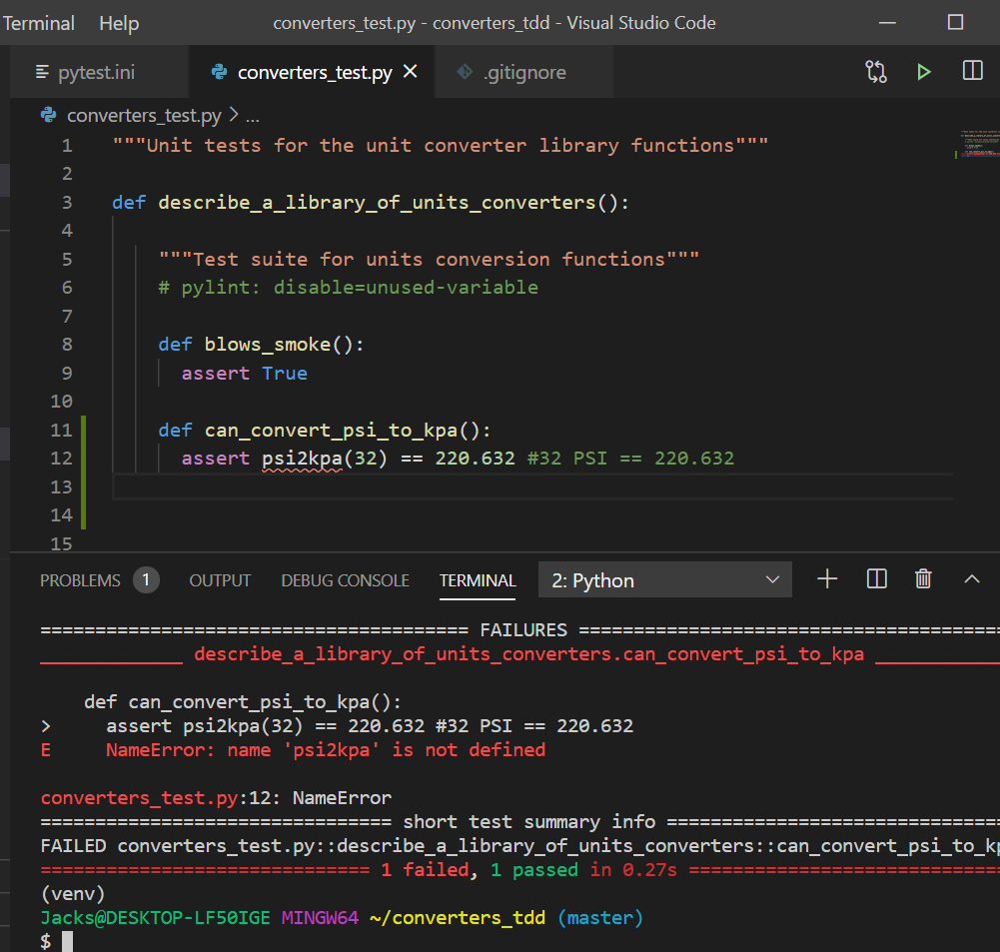
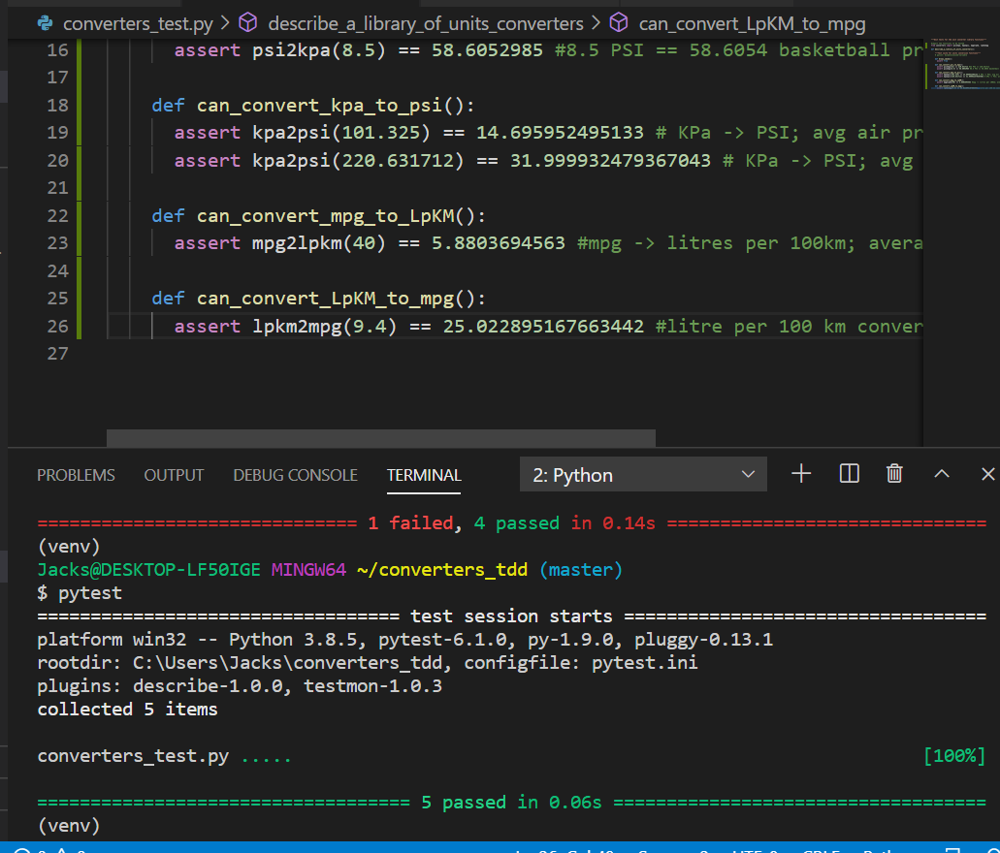
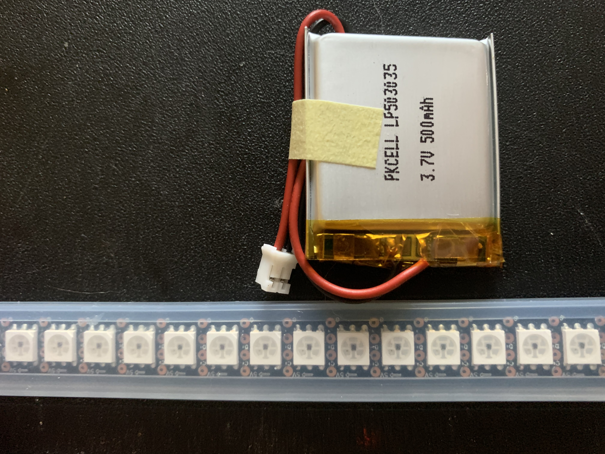
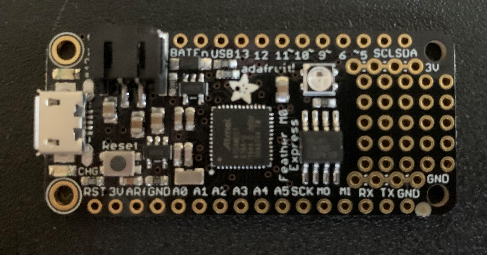
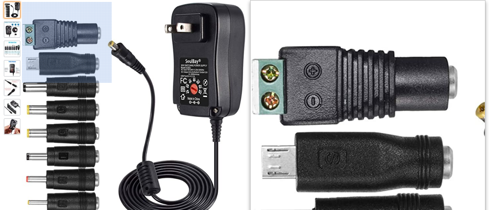

# Welcome to Jack's Homepage

You can use the [editor on GitHub](https://github.com/jcschiesl/jcschiesl.gethub.io/edit/gh-pages/index.md) to maintain and preview the content for your website in Markdown files.

Whenever you commit to this repository, GitHub Pages will run [Jekyll](https://jekyllrb.com/) to rebuild the pages in your site, from the content in your Markdown files.
## Projects
This is a link to my first "Hello World Program" [Link](https://github.com/jcschiesl/Hello_World_Program_Python.git)

Next I completed a MPG to KPL converter [Link](https://github.com/jcschiesl/functions.git)



Learning how to use tests with a TDD converter [Link](https://github.com/jcschiesl/converters_tdd.git)





## Final Project

### My adventure into CircuitPython

After contemplating how I wanted to use what I've learned this class for what seemed like ages,
I found the courage to put the brakes on the idea I initially began working to finish off this course.
I realized this course and the way it was structured was more than just proving I can write function equations, but
realizing how programming can be a tool in my life as well as a creative outlet. I began to see the light in how I can use
python the create something that I think is awesome, an idea I never felt with my initial project. After a short discussion 
in one of Dr. Benton's weekly team meetings, I saw the ability to write code to control led lights for virtually any application.
Specifically, Dr. Benton showed me a pair of super-PLUR custom LED glasses which I frankly thought were epic. It was after this 
meeting in which my adenture into CircuitPython began. 

### Materials

- 3.7v 500mAh battery
- 1/2 m DotStar LED strip



- Adafruit Feather m0 Express


### Findings

After reaseraching and understanding the basics of how to correctly wire the LED strip to this controller, I found a red flag. 
I had assumed that the 3.7v battery that plugs into the Feather m0 would also be the source of power for the LED's. This
unfortunatley turned to be untrue as a LED strip of the size I purchased requires 5 volts for operation. This slightly complicates things 
as now a second power source must be wired in. 

I found this universal 5 volt power adapter that comes with the correct (highlighted) adapter piece to easily wire in a power connection.


With this new information I had to understand how I would include the input power lines for the LED's and where they reside on the m0.


Markdown is a lightweight and easy-to-use syntax for styling your writing. It includes conventions for

```
Syntax highlighted code block

# Header 1
## Header 2
### Header 3

- Bulleted
- List

1. Numbered
2. List

**Bold** and _Italic_ and `Code` text

[Link](url) and 


For more details see [GitHub Flavored Markdown](https://guides.github.com/features/mastering-markdown/).

### Jekyll Themes

Your Pages site will use the layout and styles from the Jekyll theme you have selected in your [repository settings](https://github.com/jcschiesl/jcschiesl.gethub.io/settings). The name of this theme is saved in the Jekyll `_config.yml` configuration file.

### Support or Contact

Having trouble with Pages? Check out our [documentation](https://docs.github.com/categories/github-pages-basics/) or [contact support](https://github.com/contact) and we’ll help you sort it out.
